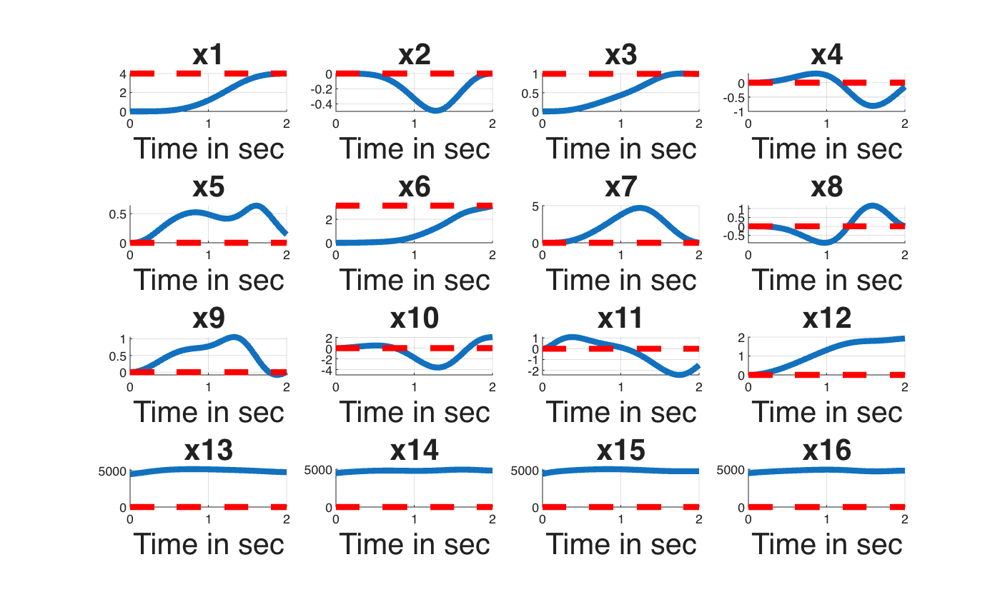
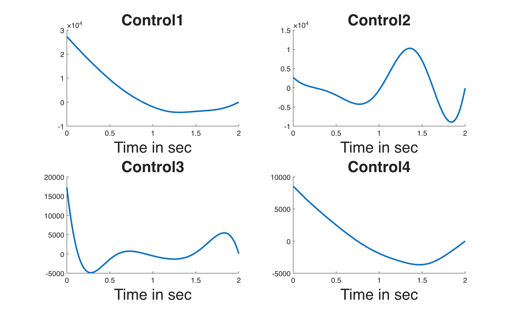
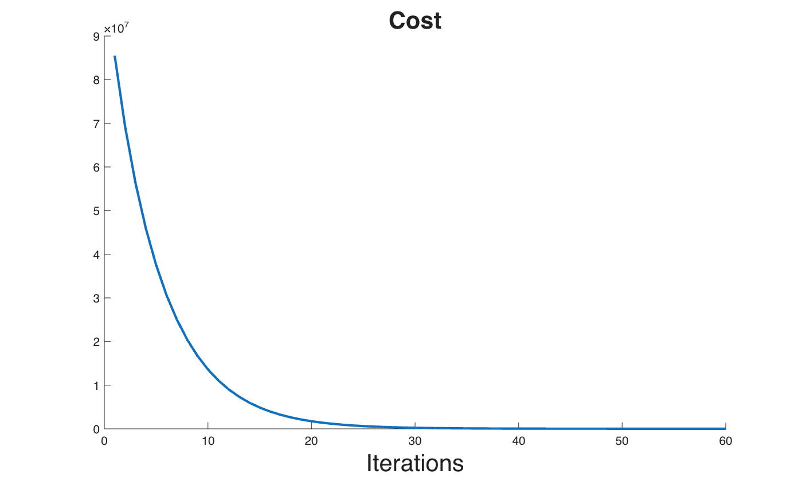
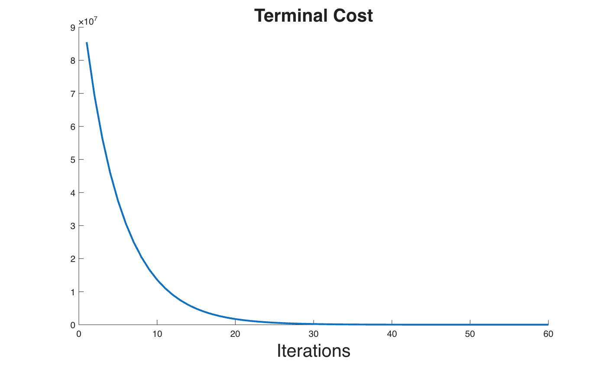

# Standard DDP — Quadrotor

Implementation of standard **Differential Dynamic Programming (DDP)** applied to a **Quadrotor** system. This serves as a baseline comparison for the Min-Max DDP algorithm.

## 📖 Description
Standard DDP is applied to a quadrotor to compute optimal control trajectories. This example demonstrates the performance of classical DDP without the min-max (adversarial) component, providing a reference point for evaluating the robustness improvements achieved by Min-Max DDP.

## 📊 Results

## 🚀 How to Run
1. Open MATLAB
2. Navigate to this folder
3. Run the main `.m` file
