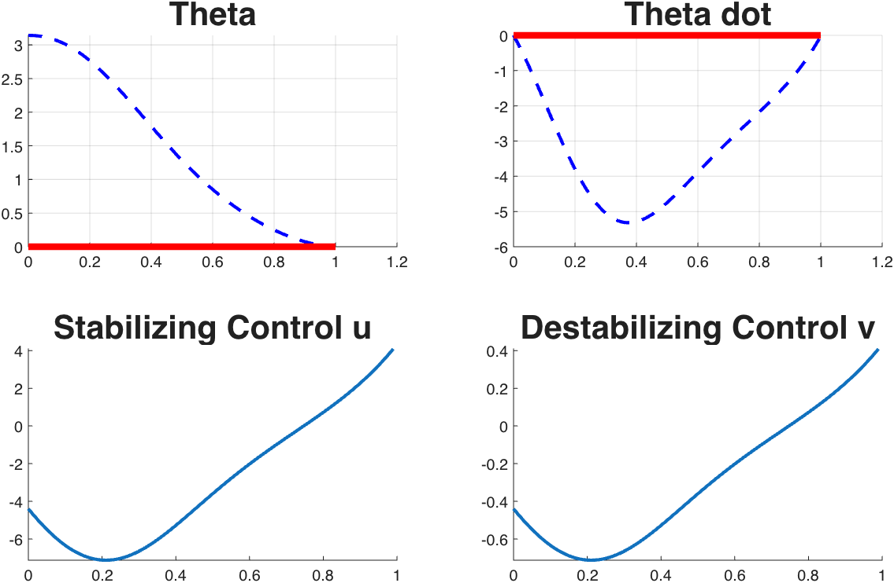
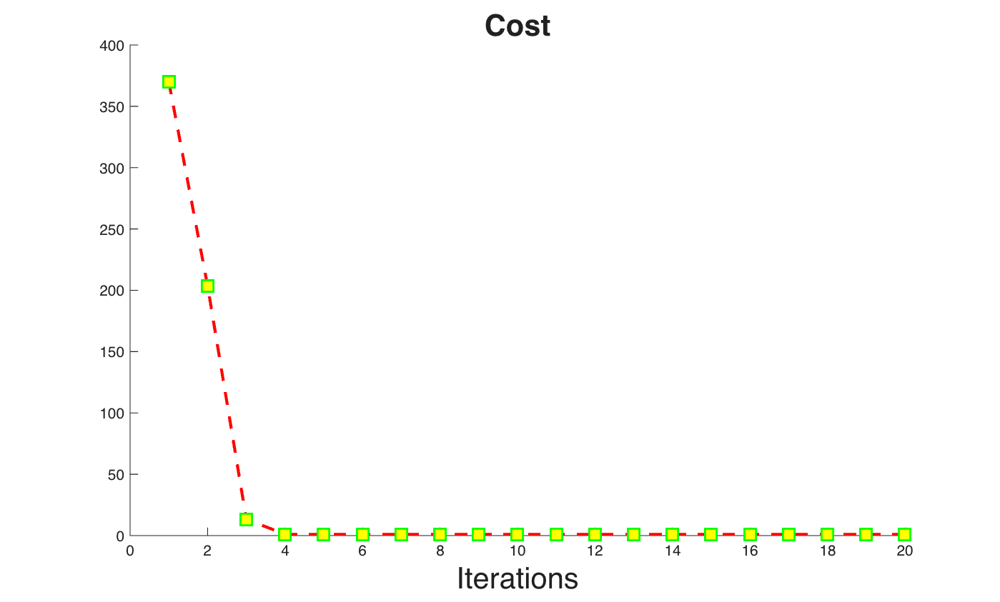

# Min-Max DDP — Inverted Pendulum (Without Terminal Cost)

Implementation of **Min-Max Differential Dynamic Programming (Min-Max DDP)** applied to an **Inverted Pendulum** system. In this example, the cost function does **not** include a terminal cost term.

## 📖 Description
The inverted pendulum is a classic benchmark problem in control theory. Here, Min-Max DDP is used to find the optimal control policy that minimizes the cost while considering worst-case disturbances. This example demonstrates the performance of Min-Max DDP without a terminal cost in the objective function.

## 📊 Results

### Figure 1

### Figure 2

## 🚀 How to Run
1. Open MATLAB
2. Navigate to this folder
3. Run `main_minimax_inverted_pen.m`
