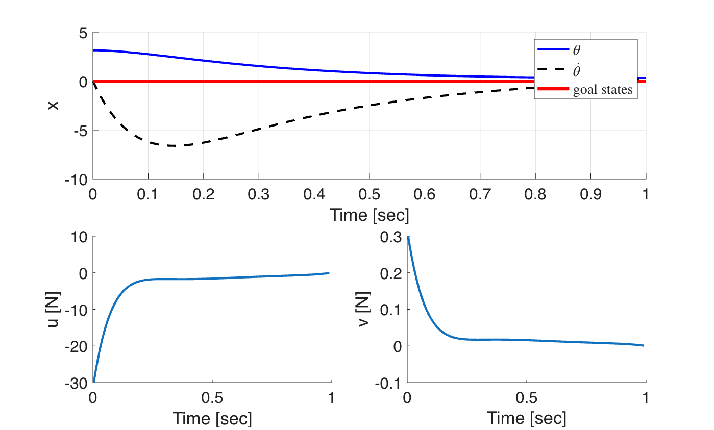

# Min-Max DDP — Inverted Pendulum (With Terminal Cost)

Implementation of **Min-Max Differential Dynamic Programming (Min-Max DDP)** applied to an **Inverted Pendulum** system. In this example, the cost function **includes** a terminal cost term.

## 📖 Description
This example extends the Min-Max DDP formulation by incorporating a terminal cost in the objective function. The terminal cost penalizes the final state, which improves convergence and control performance compared to the case without terminal cost.

## 📊 Results

## 🚀 How to Run
1. Open MATLAB
2. Navigate to this folder
3. Run `main_minimax_inverted_pen.m`

## 🔗 Related Paper
**Mohammad Sarbaz**, Wei Sun. *Continuous Time Differential Dynamic Programming for Nonzero-Sum Differential Games.* Journal of Optimization Theory and Applications, 2026. [DOI](https://doi.org/10.1007/s10957-026-02984-6)
