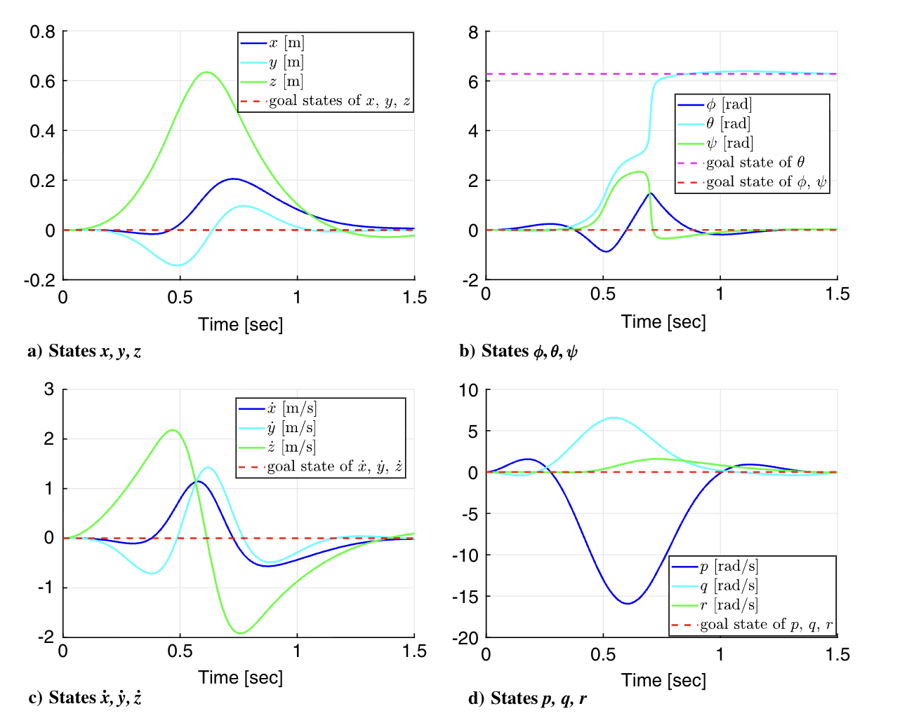
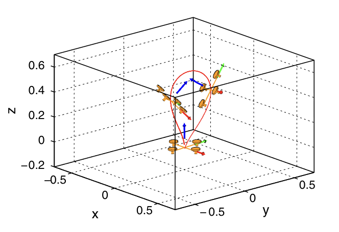
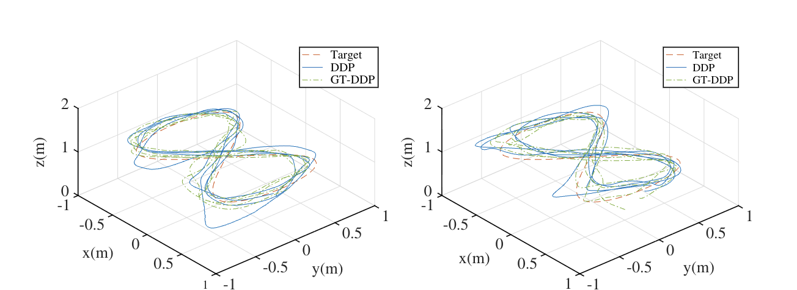
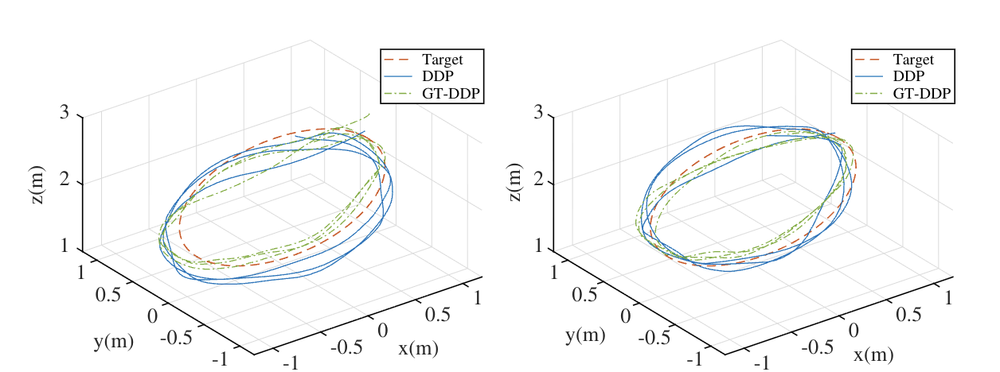

# Min-Max DDP — Quadrotor

Implementation of **Min-Max Differential Dynamic Programming (Min-Max DDP)** applied to a **Quadrotor (UAV)** system.

## 📖 Description
Min-Max DDP is applied to a quadrotor to compute optimal control trajectories under worst-case disturbances. This example demonstrates the robustness of Min-Max DDP compared to standard DDP when adversarial disturbances are present in the system dynamics.

## 📊 Results

## 🎥 Video
[▶️ Click here to watch the implementation video](video.mp4)

## 🚀 How to Run
1. Open MATLAB
2. Navigate to this folder
3. Run the main `.m` file
